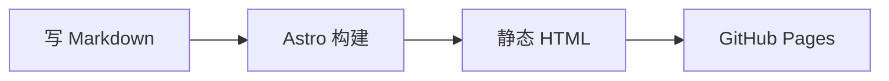

这是本站的排版测试页，用来检查文章组件和 Markdown 增强功能在亮色、暗色与移动端的表现。

## 行内元素与数学公式

支持 **加粗**、*斜体*、~~删除线~~、`行内代码`、[超链接](https://astro.build/) 和行内公式 $E = mc^2$。

独立公式块使用双美元符号：

$$
\int_{-\infty}^{\infty} e^{-x^2}\,dx = \sqrt{\pi}
$$

公式由 KaTeX 在构建时渲染，窄屏下长公式可在自身区域横向滚动。

## 脚注

脚注可以补充来源或说明，不会打断正文阅读[^source]。同一个脚注也可以再次引用[^source]。

[^source]: 脚注会显示在文章末尾，并带有返回正文的链接。

## 提示块

:::note[兼容性说明]
普通提示块保持纸墨配色，并使用语义化的提示区域。
:::

:::tip
短建议也可以用 Tip 容器表达。
:::

:::warning[需要留意]
警告与危险提示共享站点强调色，不额外引入一套互相竞争的颜色。
:::

:::danger
不要把访问者提供的 HTML 作为可信内容执行。
:::

## 代码块

代码块使用 Shiki 双主题，并支持文件名、行号和元信息高亮；复制按钮只复制源码。

```ts title="src/lib/format.ts" showLineNumbers {2,4}
export function formatDate(date: Date): string {
  const pad = (value: number) => String(value).padStart(2, '0');
  const month = pad(date.getMonth() + 1);
  const day = pad(date.getDate());
  return `${date.getFullYear()}-${month}-${day}`;
}
```

变更行使用 Shiki 注释标记：

```ts title="theme.ts" showLineNumbers
const theme = 'light'; // [!code --]
const theme = 'dark'; // [!code ++]
const accent = '#a5322a'; // [!code highlight]
```

## Mermaid 图表

Mermaid 只在含图表的文章里按需加载，图表会跟随主题切换；源码也可以展开查看。



## 表格与任务清单

| 功能 | 状态 | 说明 |
| --- | :---: | --- |
| 数学公式 | ✅ | KaTeX 构建时渲染 |
| 代码高亮 | ✅ | Shiki 双主题 |
| 搜索 | ✅ | Pagefind 静态索引 |

- [x] 写 Markdown
- [x] 本地运行构建
- [ ] 检查最终发布效果

宽表格在手机上会留在自己的可滚动区域，不会撑破正文列。

## 引用与列表

> 简单是可靠的先决条件。
>
> —— Edsger W. Dijkstra

1. 写 Markdown
2. 构建静态页面
3. 发布到 GitHub Pages

## 图片说明与放大

点击图片或用键盘聚焦后按 Enter/Space 可放大；按 Escape 或关闭按钮退出。图片标题会显示为说明文字。

 {width=1200 height=600}

## 折叠块

<details>
<summary>点开看看</summary>

原生 `<details>` 可用于不必默认展开的补充说明。

</details>

---

每个标题旁的锚点都可以复制章节链接；文章页也提供移动端目录、阅读进度、分享和复制链接。
